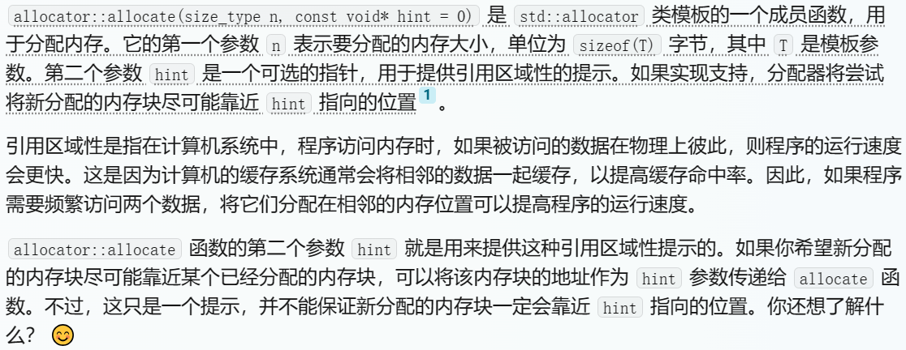
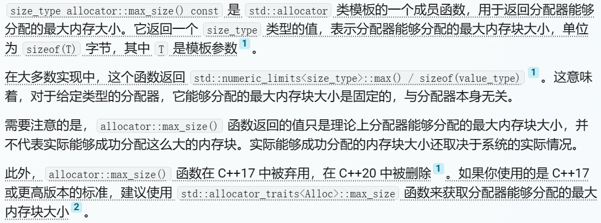
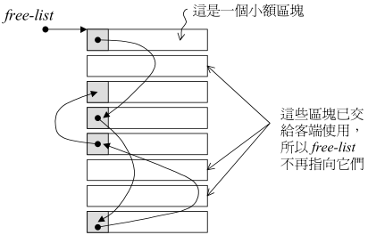
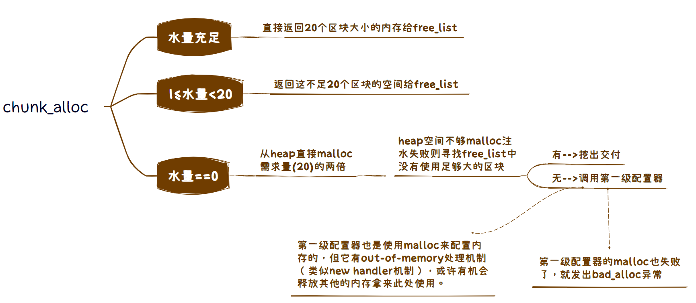
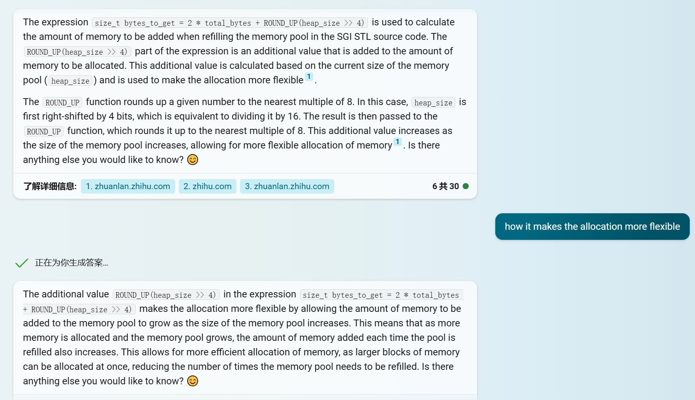

# NOTE

## 空间配置器(allocator)
申请内存>128bytes -> 第一级 -> malloc(),free()  
申请内存<128bytes -> 第二级 -> 自由链表, 内存池  

根据STL的规范，以下是allocator的必要接口：  
1. allocator::value_type
2. allocator::pointer
3. allocator::const_pointer
4. allocator::reference
5. allocator::const_reference
6. allocator::size_type
7. allocator::differenc_type
8. allocator::rebind    
   //一个嵌套的class template。  
   ~~~C++
    template <class U>
    struct rebind {
        typedef allocator<U> other;
    }
   ~~~
9. allocator::allocator()   //默认构造函数
10. allocator::allocator(const allocator&)  //拷贝构造函数
11. template <class U>allocator::allocator(const allocator\<U\>&)
    //泛化的拷贝构造函数  
12. allocator::~allocator() //析构函数
13. const_pointer allocator::address(const_reference x) const  
    //返回某个对象的地址  
14. pointer allocator::allocate(size_type n, const void* = 0)  
    //配置储存n个T对象的空间，第二个参数是提示，可能会用于增进区域性  
    

    
    

15. void allocator::deallocate(pointer p, size_type n)  //归还先前配置的空间  
16. size_type allocator::max_size() const   //返回可成功配置的最大量  
    [what-is-the-rationale-behind-stdallocatormax-size-stackoverflow](https://stackoverflow.com/questions/22183162/what-is-the-rationale-behind-stdallocatormax-size)
    

    
    

17. void allocator::construct(pointer p, const T& x)  
    // = new((void*)p) T(x)
18. void allocator::destory(pointer p)
    // = p->~T()

### 第二级配置器
1. 自由链表(free_list)
    ~~~c++
    union obj
    {
        union obj * free_list_link; //看作指针，指向链表下一个节点
        char client_data[1];        //看作指针，指向实际的内存区
    };
    ~~~
    维护16个free_list, 管理8, 16, 24 ... 128bytes的小内存块  
    <!-- 

 -->
    

    
    

    分配内存时，从free_list的头部取出内存块，取出内存后其**下一个节点变为头节点**。  
    回收内存时，将区块放入free_list头部。  
    当free_list中没有可用区块的时候调用refill()函数重新装填free_list, 其中新的空间由chunk_alloc()取自内存池，取20个区块，内存不够是取的可能少于20  
2. 内存池(memory pool)  
   chunk_alloc()将内存从内存池中取出给free_list使用。  
   

    
    

<d1>
    <dt>参考：</dt>
    <dd>https://dulishu.top/allocator-of-stl/</dd>
</d1>

## 迭代器(iterator)  
### Traits
用于获取迭代器所指对象的类型。  
1. 声明内嵌类型
   ~~~C++
    template <class T>
    struct MyIter {
        typedef T value_type;   //声明内嵌类型，便于下面函数获取返回值value_type
        T* ptr;
        MyIter(T* p=0) : ptr(p) { }
	    T& operator*() const { return *ptr; }
        // ...
    };
    template <class I>
    typename I::value_type      //func的返回类型，即T
    func(I iter) { return *iter; }

    // ...
    MyIter<int> ite(new int (8));
    cout << func(ite);	//输出8
   ~~~
   因为编译器在具体实现之前不知道`I::value_type`是成员函数还是成员变量（这里I是`MyIter<T>`）。  
   关键字`typename`在于告诉编译器`I::value_type`是类型。 
   但是，**并不是所有迭代器都是`class type`比如原生指针，所以需要偏特化。** 
2. 偏特化iterator_traits来萃取value_type
   上例加入iterator_traits:      
   ~~~C++
    template <class I>
    struct iterator_traits {
        typedef typename I::value_type value_type;
    };      //如果I定义有自己的value_type则萃取出来的就是I::value_type

    /*
        返回值相比于上面例子多了iterator_trais<I>这一层间接关系
        好处在于可以使traits拥有特化版本
    */
    template <class I>
    typename iterator_traits<I>::value_type     //func的返回类型
    func(I iter) { return *iter; }
   ~~~
   iterator_traits偏特化来萃取不同类型迭代器。  
   ~~~C++
    template <class T>
    struct iterator_traits<T*> {
        typedef T value_type;
    };      //偏特化——迭代器是原生指针

    template <class T>
    struct iterator_traits<const T*> {
        typedef T value_type;
    };      //偏特化——迭代器是指向常量的指针
   ~~~
   使iterator_traits生效要求每一个迭代器遵守约定，按要求内嵌类型定义。  
3. 迭代器型别
   ~~~C++
    template <class I>
    struct iterator_traits {
        typedef typename I::iterator_categoty   iterator_categoty;
        typedef typename I::value_type          value_type;
        typedef typename I::differenc_type      difference_type;
        typedef typename I::pointer             pointer;
        typedef typename I::reference           reference;
    };
   ~~~
4. 迭代器的分类  
   ~~~
    Input Iterator:         只读
    Output Iterator:        只写
    Forward Iterator:       区间上单项移动，每次移动一步，读写
    Bidirectional Iterator: 区间上双向移动，每次移动一步，读写
    Random Access Iterator: 涵盖指针的全部操作
   ~~~

## 全局函数
1. uninitialized_fill_n(ForwardIterator first, Size n, const T& x)
   first: 指向要初始化空间的起始处;  
   n: 要初始化空间的大小;  
   x: 初始化的值;  
   如果在[first, first + n)范围内的每一个迭代器都指向未初始化的内存则调用copy_constructor在该范围内产生x的副本。  
   若在此过程中有任意一个copy_constructor抛出异常则析构所有已产生你给的元素(commit or rollback)。  
2. 
## vector
1. 数据结构
   连续的线性空间，使用三个迭代器：  
   ~~~C++
    iterator first;             // 当前空间的头
    iterator last;              // 当前空间的尾
    iterator end_of_storage;    // 当前可用空间的尾
   ~~~
   vector实际配置的空间可能比客户端需求量大方便之后的扩充。  
2. vector构造与内存管理
   调用uninitialize.h中的全局函数，根据type_traits决定使用fill()还是constructor()  
   push_back()时首先检测是否还有备用空间，有则直接在备用空间构造，无则扩充空间（动态增加大小）。  
   动态增加大小：重开原大小两倍的空间——>将原内容拷贝过来——>在原内容后构造新元素（新空间上）——>释放原空间  

## list

## 记录
### 1. p.57 template\<int inst\>
在class中有static成员，可以使用不同的inst值来获得不同的static成员
~~~C++
template<int inst>
class _A
{
private:
    static int num;
public:
    static int get()
    {
        return num;
    }
};

template<>
int _A<0>::num = 0;

template<>
int _A<1>::num = 1;

int main()
{
    _A<0> A_0;
    _A<1> A_1;

    cout << "A_0: " << A_0.get() << endl;
    cout << "A_1: " << A_1.get() << endl;

    return 0;
}
/*
输出：
A_0: 0
A_1: 1
*/
~~~

### 2. p.57 static void (* set_malloc_handler(void (* f)())) ()
https://www.cnblogs.com/Chierush/p/3745520.html
~~~C++
static void (* set_malloc_handler(void (* f)())) ()
{
    void (* old)() = __malloc_alloc_oom_handler;
    __malloc_alloc_oom_handler = f;
    return(old);
}
~~~
set_malloc_handler是一个函数指针,参数为void (\*f)() —— 一个void (\*)()类型的函数指针f  
set_malloc_handler前面一个*号说明该函数返回一个函数指针，该函数参数列表为空，返回值为void  

### 3. p.61 (((bytes) + __ALIGN-1) & ~(__ALIGN-1));
`enum{ _ALIGN=8 } ;`, 将bytes上调至8的倍数。  
~(__ALIGN-1): 111..11000, 和别的数与相当于去掉被8除的余数=[(bytes+7)/8]*8  
https://www.zhihu.com/question/41043015  

#### 4. p.67 size_t bytes_to_get = 2 * total_bytes + ROUND_UP(heap_size >> 4);

    

说是让内存更灵活，避免频繁和系统申请内存  

### 4. new operator和operator new
- new operator/delete operator
  即new/delete操作符，不可被重载  
  new operator: 调用operator new分配空间，然后调用构造函数；  
  delete operator: 调用析构函数，然后调用operator delete释放空间；
- operator new/operator delete
  只分配/释放空间，不调用构造/析构函数。  
- Placement new
  placement new 是重载operator new的一个标准、全局的版本。它并不分配内存，只是返回指向已经分配好的某段内存的一个指针。因此不能删除它，但需要调用对象的析构函数。    

### copy和copy_backward
~~~C++
/**
   *  @brief Copies the range [first,last) into result.
   *  @ingroup mutating_algorithms
   *  @param  __first  An input iterator.
   *  @param  __last   An input iterator.
   *  @param  __result An output iterator.
   *  @return   result + (first - last)
*/
template<typename _II, typename _OI>
inline _OI copy(_II __first, _II __last, _OI __result)

/**
   *  @brief Copies the range [first,last) into result.
   *  @param  __first  A bidirectional iterator.
   *  @param  __last   A bidirectional iterator.
   *  @param  __result A bidirectional iterator.
   *  @return   result - (first - last)
   *
   *  The function has the same effect as copy, but starts at the end of the
   *  range and works its way to the start, returning the start of the result.
*/
template<typename _BI1, typename _BI2>
inline _BI2 copy_backward(_BI1 __first, _BI1 __last, _BI2 __result)
~~~
测试如下：  
~~~C++
#include <iostream>
#include <algorithm>
#include "algorithm.h"

int main() {
	int n_p[10];
	for (int i = 0; i < 10; i++) {
		n_p[i] = i;
	}
	std::cout << "my copy: " << '\n';
	int* p_copy = mystl::copy(n_p + 1, n_p + 4, n_p + 5);
	for (int i = 0; i < 10; i++) {
		std::cout << n_p[i] << ", ";
		n_p[i] = i;
	}
	std::cout << '\n' << "std copy: " << '\n';
	p_copy = std::copy(n_p + 1, n_p + 4, n_p + 5);
	for (int i = 0; i < 10; i++) {
		std::cout << n_p[i] << ", ";
		n_p[i] = i;
	}
	std::cout << '\n' << '\n';

	// copy_backward
	std::cout << "my copy_backward: " << '\n';
	int* p_copy_backward = mystl::copy_backward(n_p + 1, n_p + 5, n_p + 7);
	for (int i = 0; i < 10; i++) {
		std::cout << n_p[i] << ", ";
		n_p[i] = i;
	}
	std::cout << '\n' << "std copy_backward: " << '\n';
	p_copy_backward = std::copy_backward(n_p + 1, n_p + 5, n_p + 7);
	for (int i = 0; i < 10; i++) {
		std::cout << n_p[i] << ", ";
		n_p[i] = i;
	}
	std::cout << '\n';
    
	return 0;
}
~~~