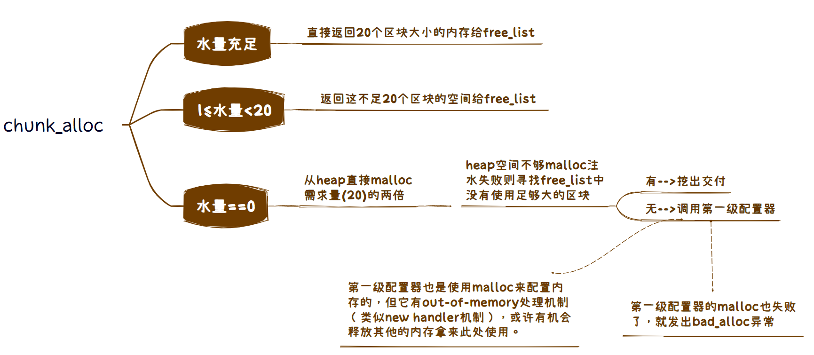

# NOTE

## 空间配置器(allocator)
申请内存>128bytes -> 第一级 -> malloc(),free() 
申请内存<128bytes -> 第二级 -> 自由链表, 内存池 
### 第二级配置器
1. 自由链表(free_list)
    ~~~c++
    union obj
    {
        union obj * free_list_link; //看作指针，指向链表下一个节点
        char client_data[1];        //看作指针，指向实际的内存区
    };
    ~~~
    维护16个free_list, 管理8, 16, 24 ... 128bytes的小内存块 
    <!-- 

 -->
    

    
    

    分配内存时，从free_list的头部取出内存块，取出内存后其**下一个节点变为头节点**。 
    回收内存时，将区块放入free_list头部。 
    当free_list中没有可用区块的时候调用refill()函数重新装填free_list, 其中新的空间由chunk_alloc()取自内存池，取20个区块，内存不够是取的可能少于20 
2. 内存池(memory pool) 
   chunk_alloc()将内存从内存池中取出给free_list使用。 
   

    
    

<d1>
    <dt>参考：</dt>
    <dd>https://dulishu.top/allocator-of-stl/</dd>
</d1>

### 记录
#### 1. p.57 template\<int inst\>
在class中有static成员，可以使用不同的inst值来获得不同的static成员
~~~C++
template<int inst>
class _A
{
private:
    static int num;
public:
    static int get()
    {
        return num;
    }
};

template<>
int _A<0>::num = 0;

template<>
int _A<1>::num = 1;

int main()
{
    _A<0> A_0;
    _A<1> A_1;

    cout << "A_0: " << A_0.get() << endl;
    cout << "A_1: " << A_1.get() << endl;

    return 0;
}
/*
输出：
A_0: 0
A_1: 1
*/
~~~

#### 2. p.57 static void (* set_malloc_handler(void (* f)())) ()
https://www.cnblogs.com/Chierush/p/3745520.html
~~~C++
static void (* set_malloc_handler(void (* f)())) ()
{
    void (* old)() = __malloc_alloc_oom_handler;
    __malloc_alloc_oom_handler = f;
    return(old);
}
~~~
set_malloc_handler是一个函数指针,参数为void (\*f)() —— 一个void (\*)()类型的函数指针f 
set_malloc_handler前面一个*号说明该函数返回一个函数指针，该函数参数列表为空，返回值为void 

#### 3. p.61 (((bytes) + __ALIGN-1) & ~(__ALIGN-1));
`enum{ _ALIGN=8 } ;`, 将bytes上调至8的倍数。 
~(__ALIGN-1): 111..11000, 和别的数与相当于去掉被8除的余数=[(bytes+7)/8]*8 
https://www.zhihu.com/question/41043015 

